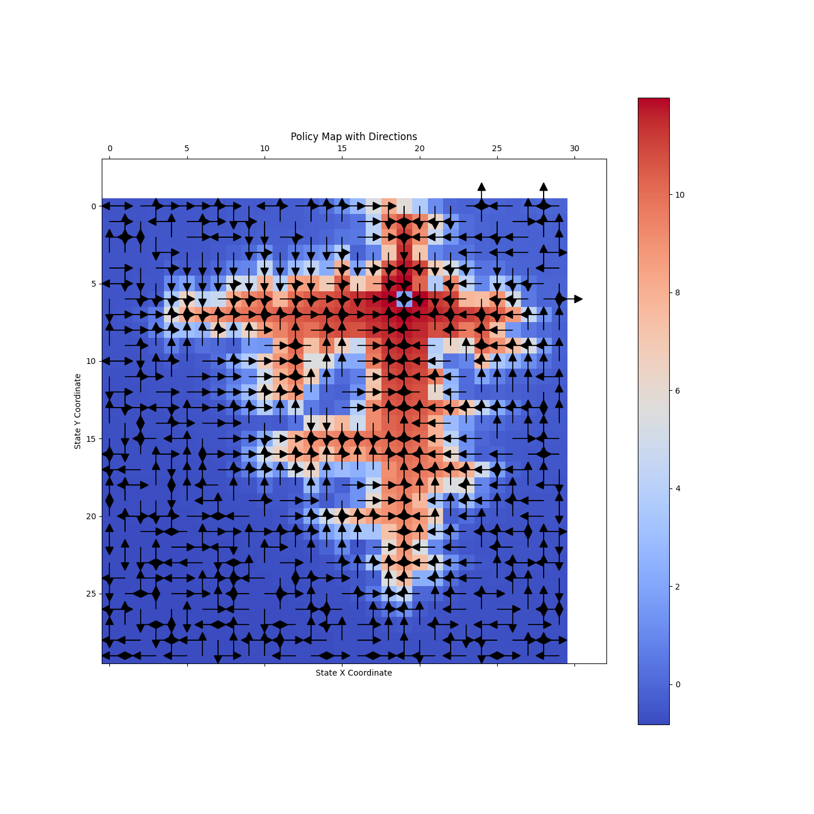
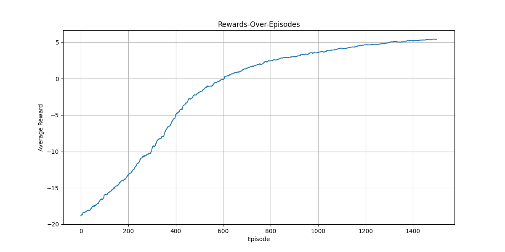
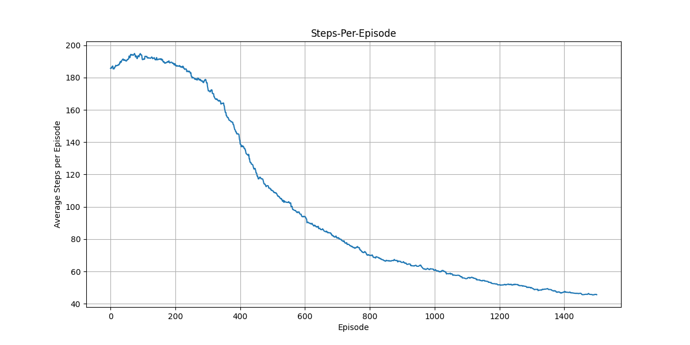

### Brief Report on Drone Navigation Project

#### Design Choices

1. **Q-Learning Algorithm**:
   - **Choice**: Q-learning was chosen for its simplicity and effectiveness in dealing with discrete, stochastic environments.
   - **Rewards System**: The reward structure is designed to balance goal achievement and efficiency:
     - **Positive Reward**: Given when the drone successfully reaches the target, encouraging goal-oriented behavior.
     - **Negative Reward for Exiting Flying Zone**: Heavily penalizes the drone for leaving the designated area to keep it inside the boundaries.
     - **Small Negative Step Reward**: A minor penalty for each move to promote efficient pathfinding.

2. **Pygame for Rendering**:
   - **Adoption**: Pygame was selected over Matplotlib for its superior performance in real-time rendering, ease of use and dynamic visualizations.
   - **Benefits**: Provides a more relying way to visualize the drone's movements and behaviors, enhancing both development and demonstration aspects of the project.

#### Challenges Faced

1. **New Framework Familiarization**:
   - **Issue**: Initial learning curve associated with understanding and implementing the Gym environment and Q-learning.
   - **Resolution**: Incremental learning and application of the framework's capabilities, supported by the documentation and community examples.

2. **Algorithm Understanding and Environment Mechanics**:
   - **Issue**: Grasping the intricacies of Q-learning's impact on environment states and rewards.
   - **Resolution**: Through trial and error, gained insights into how different reward structures affect learning outcomes.

3. **Parameter Tweaking**:
   - **Issue**: Initial parameters led to the drone never reaching its destination.
   - **Resolution**: Adjusted learning rates, discount factors, and exploration rates to find a balance that encouraged exploration.

4. **Stuck Drone in Q-Table**:
   - **Issue**: Encountered a looping behavior where the drone oscillated between two points.
   - **Resolution**: Introduced random noise in action selection to break the loop and escape deadlocks.

#### Proposed Improvements and Extensions

1. **Enhanced Exploration Techniques**:
   - **Future Implementation**: Incorporate advanced exploration methods like epsilon decay strategies or entropy-based exploration to improve the learning efficiency and coverage of the state space.

2. **Loop Detection and Resolution Algorithm**:
   - **Concept**: Develop an algorithm to detect and resolve Q-table loops by adjusting Q-values in real-time to prevent cyclic paths.
   - **Benefits**: Ensures more robust pathfinding and prevents the agent from getting stuck in suboptimal policies.

3. **Q-Value Propagation Improvements**:
   - **Improvement**: Modify the Q-value update mechanism to better propagate reward information back from the goal to earlier states.
   - **Goal**: To create a more directed and efficient learning process, ensuring that distant points correctly "point" towards the goal with higher Q-values.

### Results

The following analysis interprets the provided plots, which illustrate the drone's learning process over episodes using a Q-learning algorithm.

#### 1. Policy Map with Directions

**Interpretation**:
- The graph displays the optimal policy learned by the drone, represented by arrows on a grid. Each arrow points in the direction that the Q-learning algorithm determined to be the best action from that particular state.
- The color scale indicates the Q-values, with red showing higher values and blue indicating lower values. Higher Q-values around the landing point suggest that the drone has learned that these paths are more rewarding because they lead directly to the target.

#### 2. Rewards Over Episodes

**Interpretation**:
- This plot shows the trend of averaged rewards per episode over time. The upward trend indicates that the drone is learning to maximize its rewards over episodes, which suggests improvements in its decision-making capabilities.
- The initial negative rewards imply that the drone frequently failed or took inefficient routes at the beginning. Over time, as the learning progresses, the rewards improves, eventually stabilizing around a positive value, indicating fewer mistakes and more successful completions of the goal.

#### 3. Steps Per Episode

**Interpretation**:
- The graph illustrates a decreasing trend in the number of steps the drone takes per episode. This decrease is a strong indicator of learning efficiency, as it shows the drone is finding quicker routes to the target over time.
- The sharp decrease early in the training process followed by a gradual decline suggests initial significant learning and adaptations, with refinements occurring throughout the remaining episodes.

### Conclusion
The visual data from the plots provides compelling evidence that the Q-learning algorithm has successfully improved the drone's navigation capabilities in a simulated environment. Over time, the drone has learned to optimize both its path efficiency, as evidenced by the increased rewards and decreased steps per episode. Further improvements could be made by exploring different reward structures, increasing the complexity of the environment, or adjusting the learning parameters to refine the learning process further.

<!--stackedit_data:
eyJoaXN0b3J5IjpbLTYzNDkxMTU2MF19
-->
